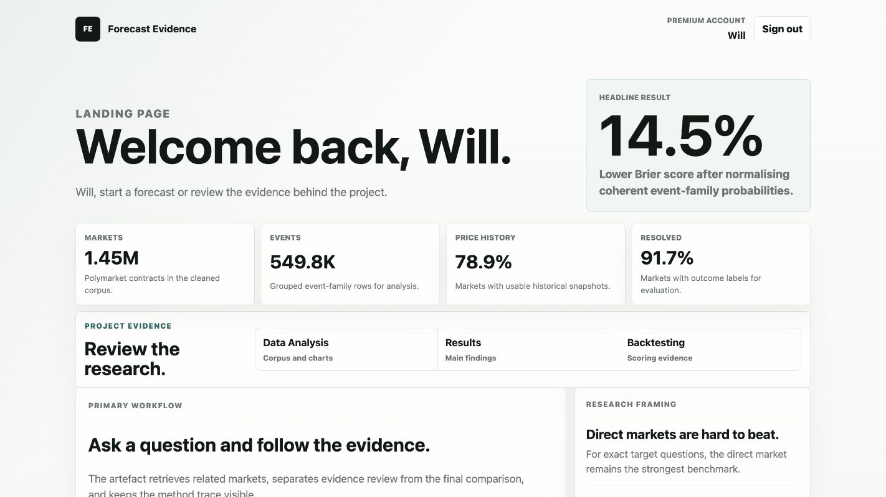
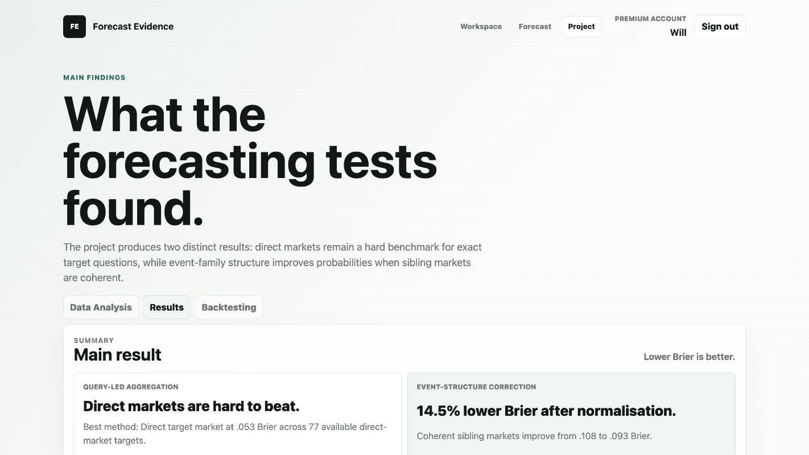
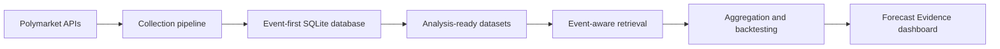

# Forecast Evidence

An end-to-end prediction-market analytics system for collecting, structuring,
retrieving and evaluating forecasting evidence from Polymarket.

The project combines a large event-first data platform with information
retrieval, historical backtesting, probabilistic evaluation and an interactive
dashboard. It was developed for an MSc Data Analytics dissertation awarded 82%;
the degree was completed with Distinction.



## Key results

| Area | Result |
| --- | --- |
| Dataset | 549,832 events and 1,448,372 markets in the final project snapshot |
| Coverage | 91.72% resolved markets and 78.91% with usable price history |
| Query-led backtest | 3,358 evaluated forecast rows across 78 target markets with 0 leakage rows |
| Strongest target method | Direct target market: Brier 0.052728 and log loss 0.177394 |
| Event-family normalisation | Brier improved from 0.108185 to 0.092502 (14.5%) |
| Event-family normalisation | Log loss improved from 0.333893 to 0.294444 (11.81%) |

The results are deliberately balanced: a direct market is difficult to beat
when an exact target exists, while normalising probabilities can improve
forecast quality for coherent families of sibling markets.



## System overview



The database was redesigned from a market-first structure to an event-first
model so related outcomes, categories and price histories remain connected.
This structure supports event-level retrieval, sibling-market normalisation and
historical evaluation without treating every market as an isolated record.

## What the project includes

- Automated collection from the Polymarket Gamma and CLOB APIs.
- An event-first relational database for events, markets, outcomes and price
  histories.
- Analysis-ready datasets with validation and quality checks.
- Transparent TF-IDF and event-aware retrieval, plus labelled embedding
  experiments.
- Multiple aggregation strategies, including direct, nearest-market,
  similarity-weighted and liquidity-weighted methods.
- Historical evaluation using Brier score, log loss and calibration.
- Event-family probability normalisation for coherent sibling outcomes.
- An interactive dashboard for dataset analysis, findings, backtesting and
  forecast evidence review.

## Explore the dashboard locally

The committed dashboard data is sufficient to explore the analysis, results
and backtesting pages without the full local database.

Requirements:

- Node.js
- A modern web browser

Start the local server:

```bash
npm run dev
```

Open `http://127.0.0.1:4285/` and use either demonstration account:

```text
free@example.test / free-demo
premium@example.test / premium-demo
```

The custom forecast-question workflow requires generated retrieval artefacts
and the local SQLite database. Those large generated files are intentionally
excluded from Git.

## Reproduce the pipeline

Create a Python environment and install the analysis dependencies:

```bash
python3 -m venv .venv
source .venv/bin/activate
pip install -r requirements.txt
```

The complete pipeline is organised into seven stages:

1. Polymarket data collection
2. Event-first database creation and loading
3. Analysis dataset preparation
4. Descriptive analysis
5. Retrieval evaluation
6. Forecast aggregation and backtesting
7. Dashboard and forecast service

See [docs/run_order.md](docs/run_order.md) for script order, expected outputs,
validation checks and known limitations.

## Repository structure

```text
config/    Small configuration and labelled evaluation files
data/      Ignored local databases and generated outputs
docs/      Reproduction notes and technical documentation
scripts/   Collection, database, analysis, retrieval and forecasting pipeline
website/   Dashboard interface and compact committed data assets
```

## Technology

**Data and analysis:** Python, pandas, NumPy, SciPy, scikit-learn, SQLite,
PyArrow and sentence-transformers

**Visualisation and application:** Matplotlib, Seaborn, HTML, CSS, JavaScript
and Node.js

**Methods:** relational data modelling, information retrieval, feature
engineering, probabilistic forecasting, calibration analysis and historical
backtesting

## Data and reproducibility

The full SQLite database and generated analysis artefacts are approximately
18 GB locally and are not stored in Git. The repository retains the complete
pipeline, configuration, labelled retrieval queries and compact dashboard data.

A fresh collection run depends on current Polymarket API availability and may
produce a different snapshot from the final dissertation dataset. Reported
results in this README refer to the final project snapshot.

## Limitations

- Results are specific to Polymarket and the available historical coverage.
- Market prices are probability-like signals, not guaranteed probabilities.
- Related markets are correlated and should not be treated as independent
  forecasts.
- Broad aggregation can dilute a strong direct-market signal.
- Historical performance does not guarantee future forecasting performance.
- The authentication and custom forecast service are local research prototypes,
  not production services.

## Responsible use

This repository is an academic forecasting and decision-support project. It is
not financial advice, a trading system or an automated decision-maker.

## Licence

Copyright (c) 2026 William West. All rights reserved. This repository is
publicly available for portfolio and academic review. No permission is granted
to reproduce, modify, distribute or commercially use its contents.
